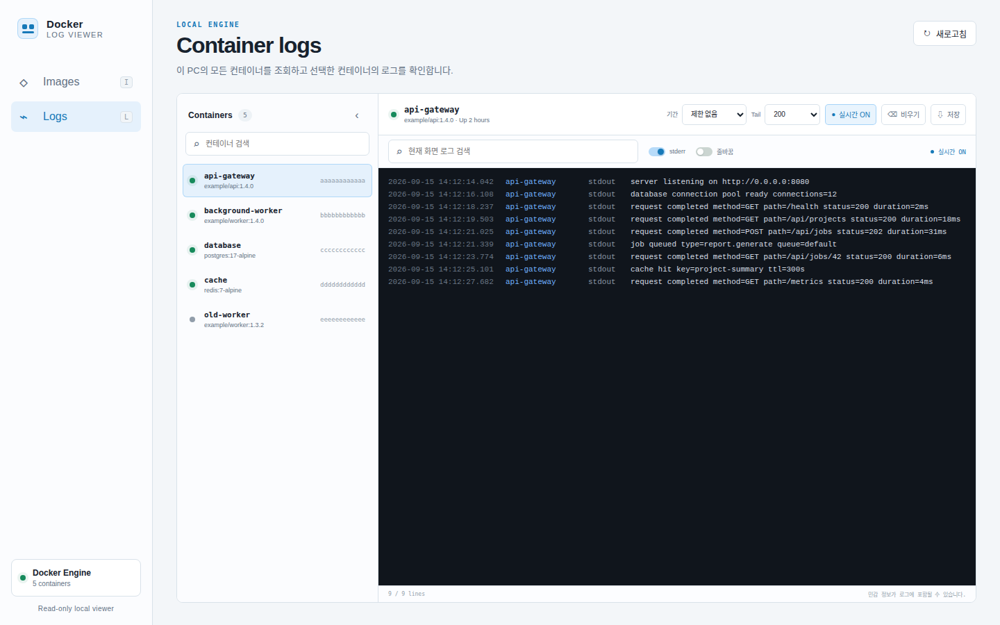

<p align="center">
  
</p>

<h1 align="center">Docker Log Viewer</h1>

<p align="center">
  여러 Docker 호스트의 컨테이너와 이미지를 탐색하고,<br>
  선택한 컨테이너의 과거·실시간 로그를 브라우저로 확인하는 읽기 전용 도구입니다.
</p>

<p align="center">
  <a href="https://github.com/east-true/docker-log-viewer/actions/workflows/ci.yml"></a>
  
  <a href="LICENSE"></a>
  
</p>

<p align="center">
  <a href="#빠른-시작">빠른 시작</a> ·
  <a href="#아키텍처">아키텍처</a> ·
  <a href="#주요-기능">주요 기능</a> ·
  <a href="#보안">보안</a> ·
  <a href="#개발과-테스트">개발</a>
</p>



<p align="center"><sub>문서용 합성 데이터로 만든 화면입니다. 실제 로컬 컨테이너나 이미지 정보는 포함하지 않습니다.</sub></p>

## 왜 Docker Log Viewer인가요?

로그 한 줄을 확인하기 위해 컨테이너 관리 플랫폼 전체나 중앙 로그 저장소를 운영할 필요는 없습니다. Docker Log Viewer는 각 호스트의 Docker Engine을 실시간 권위로 사용하면서, 로그 확인에 필요한 화면만 중앙 Server에 제공합니다.

| 원칙                | 동작                                                                                                      |
| ------------------- | --------------------------------------------------------------------------------------------------------- |
| 명확한 권한 경계    | Server는 Docker 소켓을 보지 않습니다. 각 호스트의 Agent만 로컬 Engine에 접근합니다.                       |
| Agent outbound 연결 | Agent가 Server로 reverse gRPC 세션을 시작하며 Agent에는 inbound 포트가 없습니다.                          |
| 읽기 전용           | 컨테이너 시작·중지·삭제 또는 Docker 설정 변경 API가 없습니다.                                             |
| 저장하지 않음       | Server는 inventory와 로그를 수집·보관하지 않습니다. 브라우저 메모리에 최근 10,000줄만 유지합니다.         |
| 작은 배포 단위      | 하나의 Go 바이너리가 `server`와 `agent` 두 실행 모드 및 웹 UI를 포함합니다. 별도 데이터베이스가 없습니다. |

## 아키텍처

```text
                         HTTPS
Browser ─────────────────────────────────▶ Docker Log Viewer Server
                                           UI / read-only HTTP API
                                                     ▲
                                                     │ Agent-initiated
                                                     │ reverse gRPC session
                                                     │
                               Docker Log Viewer Agent A
                               local Docker socket    │
                                                     ▼
                                               Docker Engine A

                               Docker Log Viewer Agent B
                               local Docker socket    │
                                                     ▼
                                               Docker Engine B
```

중앙에 Server 하나를 실행하고 조회할 Docker 호스트마다 Agent 하나를 실행합니다. 브라우저는 연결된 Agent의 inventory를 함께 불러옵니다. Logs의 컨테이너 목록은 Host별 접이식 제목으로 구분되고, Images는 각 행의 Host 열로 출처를 표시합니다.

- Docker의 현재 상태와 로그는 Docker Engine이 소유합니다.
- Agent가 Docker API를 호출하며 Server는 요청과 응답을 중계합니다.
- 여러 로그 요청은 하나의 지속 연결에서 요청 ID로 구분됩니다.
- 브라우저가 로그 요청을 취소하면 Server가 Agent에 취소를 전달하고 Docker 로그 읽기도 종료합니다.
- Agent는 영속 state directory에 ID를 저장하므로 재시작 후에도 같은 호스트로 식별됩니다.

## 빠른 시작

### Docker Compose

Linux, Docker Engine, Docker Compose v2가 필요합니다. Agent 연결용 token과 브라우저 접근용 token을 각각 파일로 만듭니다.

```bash
git clone https://github.com/east-true/docker-log-viewer.git
cd docker-log-viewer
umask 077
openssl rand -hex 32 > agent-token
openssl rand -hex 32 > web-token
docker compose up --build -d
```

브라우저에서 <http://127.0.0.1:8080>을 열고 사용자 이름 `docker-log-viewer`, 비밀번호는 `web-token` 파일의 값을 입력하세요. Compose 구성은 Server와 로컬 Agent를 별도 컨테이너로 실행하며, Docker 소켓은 Agent에만 마운트합니다.

신뢰할 수 있는 사설망의 다른 PC에 공개하려면 bind address를 명시합니다.

```bash
DOCKER_LOG_VIEWER_BIND_ADDRESS=0.0.0.0 docker compose up --build -d
```

이 경우에도 HTTP Basic credential과 로그가 평문 HTTP를 지나므로 VPN 또는 TLS reverse proxy를 권장합니다. 인터넷에 직접 공개하지 마세요.

```bash
docker compose down
```

Agent ID를 유지하는 `agent-state` volume은 기본적으로 보존됩니다. 완전히 제거하려는 경우에만 `docker compose down --volumes`를 사용하세요.

> [!IMPORTANT]
> Compose 예시는 동일 Docker network 안에서만 Agent transport를 평문으로 사용합니다. 다른 호스트의 Agent를 연결할 때는 반드시 아래 TLS 구성을 사용하세요.

### 소스에서 실행

빌드 후 서로 다른 터미널에서 Server와 Agent를 실행합니다.

```bash
go build -o docker-log-viewer ./cmd/docker-log-viewer
umask 077
openssl rand -hex 32 > agent-token
openssl rand -hex 32 > web-token
```

```bash
./docker-log-viewer server \
  -listen 127.0.0.1:8080 \
  -agent-listen 127.0.0.1:9080 \
  -agent-token-file ./agent-token \
  -web-token-file ./web-token \
  -agent-insecure
```

```bash
mkdir -p "$PWD/.local/agent-state"
./docker-log-viewer agent \
  -server 127.0.0.1:9080 \
  -state-dir "$PWD/.local/agent-state" \
  -name local-docker \
  -agent-token-file ./agent-token \
  -insecure
```

`-agent-insecure`와 `-insecure`는 같은 PC 또는 격리된 개발 network에서만 사용하세요.

### 브라우저 UI TLS

UI를 network에 직접 노출할 때는 브라우저 인증 token과 TLS 1.3 인증서를 함께 설정합니다.

```bash
./docker-log-viewer server \
  -listen 0.0.0.0:8080 \
  -web-token-file ./web-token \
  -web-tls-cert ./server.crt \
  -web-tls-key ./server.key \
  -agent-listen 127.0.0.1:9080 \
  -agent-token-file ./agent-token \
  -agent-insecure
```

브라우저 인증 사용자 이름은 `docker-log-viewer`로 고정되며 token이 비밀번호입니다. `/api/health`만 인증 없이 상태 확인에 사용할 수 있습니다.

### 원격 Agent와 TLS

Server의 Agent transport에는 TLS 1.3 인증서와 개인 키를 지정합니다.

```bash
docker-log-viewer server \
  -listen 127.0.0.1:8080 \
  -agent-listen 0.0.0.0:9080 \
  -agent-token-file /run/secrets/agent-token \
  -tls-cert /run/secrets/server.crt \
  -tls-key /run/secrets/server.key
```

각 Docker 호스트의 Agent는 Server 인증서를 발급한 CA를 신뢰하고 outbound 연결을 시작합니다.

```bash
docker-log-viewer agent \
  -server logs.internal.example:9080 \
  -server-ca /run/secrets/server-ca.crt \
  -tls-server-name logs.internal.example \
  -agent-token-file /run/secrets/agent-token \
  -state-dir /var/lib/docker-log-viewer \
  -name production-01
```

Agent에는 수신 포트를 열 필요가 없습니다.

## 주요 기능

### Hosts

- 여러 Agent의 연결 상태와 마지막 관측 시각 조회
- Logs의 Host별 접이식 컨테이너 목록과 Images의 Host 열
- 모든 Agent inventory 수동 새로고침 및 자동 새로고침 주기 선택(끔, 5초, 10초, 30초, 60초)
- Agent 재연결 시 영속 ID 유지 및 이전 세션 교체
- 연결이 끊긴 Agent를 offline으로 명시

### Logs

- 연결된 모든 호스트에서 실행 중이거나 중지된 컨테이너 조회 및 통합 검색
- Host별 접이식 제목 아래에서 컨테이너를 선택하면 해당 Agent로 로그 요청
- 선택한 컨테이너의 최근 로그와 실시간 로그 스트리밍
- 100~5,000줄, 전체 tail 또는 최근 5분~7일 범위 선택
- 날짜와 밀리초가 포함된 로컬 시간 표시
- 대소문자를 구분하지 않는 현재 버퍼 검색
- stderr 숨김, 긴 줄 줄바꿈, 화면 비우기 및 파일 저장
- 실시간 ON/OFF 전환 시 기존 로그와 스크롤 문맥 유지
- 연결 복구 시 마지막 Docker 타임스탬프부터 재개하고 경계 로그 중복 제거
- 연결 끊김은 로그 행에 섞지 않고 상태 영역에 `재연결 중`으로 표시하며 브라우저는 지수 backoff로 로그를 재요청
- 위로 스크롤한 동안 들어온 새 로그 개수와 최신 위치 이동 버튼 표시

### Images

- 연결된 모든 호스트의 이미지 조회 및 통합 검색
- Image ID 대신 Host 열로 이미지가 존재하는 Docker 호스트 표시
- 이미지 크기와 생성 시점 표시
- 각 이미지를 사용하는 컨테이너와 실행 상태 표시
- 전체 이미지, 사용 중 이미지, 실행 컨테이너가 연결된 이미지 집계

### 키보드

| 키           | 이동   |
| ------------ | ------ |
| <kbd>I</kbd> | Images |
| <kbd>L</kbd> | Logs   |

입력 필드에 포커스가 있을 때는 단축키가 동작하지 않습니다.

## 범위와 한계

Docker Log Viewer가 잘 맞는 경우:

- 여러 개발 PC 또는 소규모 Linux Docker 서버의 로그를 한 웹 화면에서 확인할 때
- Docker CLI를 반복 입력하지 않고 과거 로그와 실시간 로그를 오갈 때
- 컨테이너 조작 기능과 중앙 로그 보관이 없는 읽기 전용 화면이 필요할 때

다음 용도로는 설계되지 않았습니다:

- 장기 로그 보관, 인덱싱, 정규식·SQL 기반 분석 또는 전체 호스트 로그 합치기
- 사용자 계정, 역할 기반 접근 제어, Agent별 credential 폐기 또는 감사 로그
- Compose, 네트워크, 볼륨 및 컨테이너 수명 주기 관리
- Kubernetes 또는 Docker Swarm 관제
- Loki, Elasticsearch, Grafana 같은 관측 플랫폼 대체

현재 Server는 연결된 Agent registry를 메모리에 유지합니다. Server 재시작 후 Agent가 자동 재연결하면 다시 나타나며, inventory나 로그는 복제하지 않습니다.

## 설정

### Server

| 설정                            | 기본값           | 설명                                  |
| ------------------------------- | ---------------- | ------------------------------------- |
| `-listen`                       | `127.0.0.1:8080` | 브라우저 HTTP(S) 수신 주소            |
| `-web-token-file`               | 없음             | 32자 이상의 브라우저 Basic auth token |
| `-web-tls-cert`, `-web-tls-key` | 없음             | 브라우저 UI TLS 1.3 인증서와 키       |
| `-max-log-streams`              | `32`             | 동시 브라우저 로그 스트림 상한        |
| `-agent-listen`                 | `127.0.0.1:9080` | Agent gRPC 수신 주소                  |
| `-agent-token-file`             | 없음             | 32자 이상의 공유 Agent token 파일     |
| `-tls-cert`, `-tls-key`         | 없음             | Agent transport TLS 1.3 인증서와 키   |
| `-agent-insecure`               | `false`          | Agent transport 평문 허용             |

### Agent

| 설정                | 기본값                       | 설명                         |
| ------------------- | ---------------------------- | ---------------------------- |
| `-server`           | `127.0.0.1:9080`             | Server Agent transport 주소  |
| `-state-dir`        | `/var/lib/docker-log-viewer` | 영속 Agent ID 디렉터리       |
| `-name`             | hostname                     | UI에 표시할 호스트 이름      |
| `-agent-token-file` | 없음                         | Server와 공유하는 token 파일 |
| `-server-ca`        | 없음                         | Server 인증용 CA PEM         |
| `-tls-server-name`  | 없음                         | 검증할 Server 인증서 이름    |
| `-insecure`         | `false`                      | Server 연결 평문 허용        |

두 모드 모두 Agent token 파일 대신 `DOCKER_LOG_VIEWER_AGENT_TOKEN` 환경 변수를 사용할 수 있습니다. Server의 브라우저 token은 `DOCKER_LOG_VIEWER_WEB_TOKEN`도 지원합니다. 파일 기반 secret을 권장합니다.

## 보안

> [!WARNING]
> 브라우저 인증은 하나의 공유 Basic auth token이며 사용자별 계정이나 RBAC는 아닙니다. network에 공개할 때는 TLS와 함께 사용하고, 인터넷에 직접 노출하지 마세요.

- 컨테이너 로그에는 토큰, 비밀번호, 개인정보가 포함될 수 있습니다.
- Docker 소켓은 Agent에만 연결되지만, 읽기 전용 파일 마운트가 Docker Engine API의 강한 권한을 줄이지는 않습니다.
- Server와 Agent는 32자 이상의 공유 token으로 세션을 인증합니다. 현재 Agent별 token과 폐기 기능은 없습니다.
- Compose는 Agent token과 브라우저 token을 environment가 아닌 secret 파일로 전달합니다.
- 원격 연결은 TLS를 사용하세요. 평문 옵션은 명시적으로 설정해야 하며 개발 환경 전용입니다.
- Server API는 GET 요청만 제공하고 Agent는 Docker 조회 API만 호출합니다.
- 응답은 저장 금지, CSP, frame 차단, MIME sniffing 차단, permissions 제한 header를 포함합니다.
- Server는 동시 로그 스트림 수와 HTTP header 크기를 제한하며, Compose는 secret 읽기에 필요한 `DAC_READ_SEARCH` 외 capability 제거, read-only root filesystem, PID 제한을 적용합니다.
- 브라우저에서 저장한 로그 파일은 사용자가 직접 보호하고 삭제해야 합니다.

## HTTP API

모든 브라우저 API는 읽기 전용이며 응답 캐싱을 비활성화합니다.

| 경로                                        | 응답                                       |
| ------------------------------------------- | ------------------------------------------ |
| `GET /api/health`                           | Server HTTP 상태                           |
| `GET /api/agents`                           | 알려진 Agent와 연결 상태                   |
| `GET /api/containers?agent=<uuid>`          | 선택한 Agent의 전체 컨테이너               |
| `GET /api/images?agent=<uuid>`              | 선택한 Agent의 이미지와 컨테이너 사용 상태 |
| `GET /api/logs?agent=<uuid>&container=<id>` | 선택한 컨테이너의 NDJSON 로그 스트림       |

로그 API는 `tail=1..10000|all`, `since=5m|15m|1h|6h|24h|7d|RFC3339`, `follow=true|false`를 지원합니다. `container`에는 전체 64자리 ID가 필요합니다.

## 문제 해결

### Agent가 나타나지 않음

Server와 Agent의 token이 같은지, 원격 구성이라면 CA와 인증서 이름이 올바른지 확인하세요. Agent 로그에는 연결 실패와 지수 backoff 재시도 상태가 표시됩니다.

### 컨테이너는 보이지만 로그가 없음

해당 Agent 호스트에서 `docker logs <container>`가 출력되는지 확인하세요. Docker Engine에서 제공하지 않는 로그는 Docker Log Viewer에서도 표시할 수 없습니다.

### Agent ID가 매번 바뀜

`-state-dir`이 영속 저장소인지 확인하세요. Compose에서는 `agent-state` volume이 이 역할을 합니다.

## 개발과 테스트

```bash
gofmt -w ./cmd ./internal
go vet ./...
go test -race ./...
go build ./cmd/docker-log-viewer
npm ci
npm test
```

통합 UI 테스트는 Server, 로컬 Agent, 임시 로그 컨테이너를 함께 실행합니다. README 스크린샷은 실제 Docker 정보를 사용하지 않고 합성 Agent/API fixture로만 생성합니다.

```bash
npm run docs:screenshot
```

GitHub Actions는 Go 포맷·vet·race 테스트·빌드, reverse gRPC 통합 테스트, 컨테이너 이미지 빌드, JavaScript/Chromium UI 테스트, 실제 로그 중지·재개, Gitleaks 전체 이력 검사를 수행합니다.

## 릴리즈

시맨틱 버전 태그를 푸시하면 모든 CI가 성공한 뒤 GitHub Release와 라벨 기반 릴리즈 노트가 자동 생성됩니다.

```bash
git tag v0.1.0
git push origin v0.1.0
```

## 프로젝트 구조

```text
cmd/docker-log-viewer/       server/agent 실행 진입점
internal/dockerengine/      Agent의 Docker Engine 읽기 전용 어댑터
internal/transport/         Agent-initiated reverse gRPC와 세션 registry
internal/web/               Server HTTP API와 임베디드 웹 UI
scripts/                    문서용 합성 스크린샷 도구
tests/ui/                   브라우저 및 로그 조립기 테스트
```

## 기여하기

버그와 기능 제안은 [GitHub Issues](https://github.com/east-true/docker-log-viewer/issues)에 등록해 주세요. 변경 사항은 작은 단위로 테스트와 함께 pull request로 제출하는 것을 권장합니다.

보안 취약점이나 실제 secret은 공개 이슈에 올리지 마세요.

## 라이선스

[Apache License 2.0](LICENSE)
